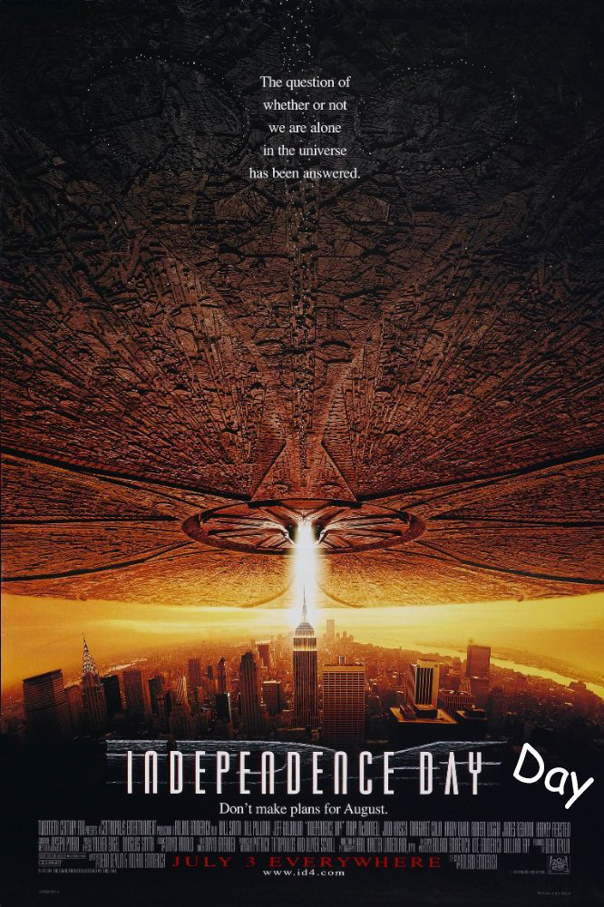
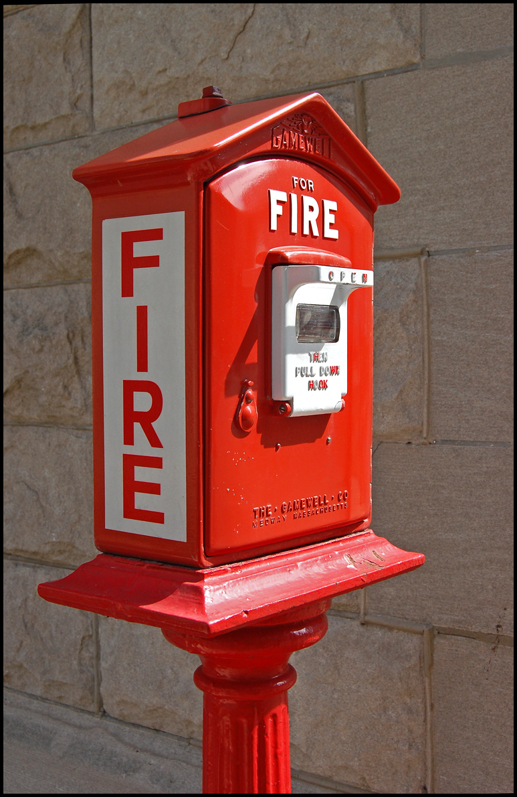

*[Telegraph]: The Linker-Gendelsman Telecommunication Graphical System
*[MORSE]: Main Original Response Standard Environment

# Welcome to the future of communication.

We're using cutting edge technology, adaptable software, and human ingenuity to revolutionize the way we communicate. Introducing:

## The Linker-Gendelsman Telecommunication Graphical System

Often shortened to "Telegraph" for efficiency, the LGTGS is the base hardware and language for the full Morsr product line, expected to release Summer 2018. When using the Telegraph, each letter in the alphabet is converted into "dots" and "dashes". These codes can be displayed visually through an LED module, audibly through a buzzer module, or physically through a vibration module. These codes are formally referred to as: 

## Main Original Response Signal Extender

As we understand that this is a bulky name, it can be abbreviated to M.O.R.S.E. to save time. The English alphabet is shown below with each letter's corresponding MORSE code.

~~~~
Letter 	MORSE
A 	.-
B 	-...
C 	-.-.
D 	-..
E 	.
F 	..-.
G 	--.
H 	....
I 	..
J 	.---
K 	-.-
L 	.-..
M 	--
N 	-.
O 	---
P 	.--.
Q 	--.-
R 	.-.
S 	...
T 	-
U 	..-
V 	...-
W 	.--
X 	-..-
Y 	-.--
Z 	--..
~~~~

# Applications

The Telegraph is a versatile tool, usable for a wide variety of markets and solutions. Our Summer 2018 launch will include the following three intitiatives, but more are planned for down the line.

### Morsr Dating

_Are you single?_

_Do you have trouble communicating your feelings with **words**?_

_Does your heart soar when you think of the Linker-Gendelsman Telecommunication Graphical System?_

If you answered yes to any or all of those questions, then we've got the dating app for you! Morsr is a free platform for Telegraph enthusiasts to meet people and find love. "Swipe" left or right to judge your possible matches, just like on other dating apps. But unlike others, Morsr has no keyboard; only a single button! Morsr Dating will launch with a premium subscription that removes pictures altogether in favor of user inputted descriptions of themselves.

### Morsr "Independence Day" Day

By now, I'm sure you've seen the classic Will Smith and Jeff Goldblum film "independence Day," in which the Telegraph is used to communicate between human miltary organizations in order to coordinate attacks against the extraterrestrial invaders. As this was a monumental step in promotion of our technology, we've declared **July 3rd** of each year to be **Independence Day Day**, on which it is customary to read out Bill Pullman's rousing speech as President of the United States on your Telegraph device(s)!

### Morsr Alarm Box

With 21st Century smoke detectors and ceiling sprinklers constantly advancing to deeper and deeper levels of complexity and connectivity, we wanted to roll out a new set of safety devices that will be able to help first responders across the country. Using our new Morsr Alarm Boxes, a Firehouse Watchdesk can connect to street corners, with tests showing the signal can move along a cable nearly **3 feet long**. All a civilian has to do is pull the nearest Morsr Alarm Box to a fire, and the department will be signaled by that box.

# The Future

Our hack has a very low bar to entry; anyone with access to basic electronic components can create their own "Do-It-Yourself" Telegraph. If truly inspired, one could memorize MORSE code and practice till an Arduino Sketch is slower than their mental translation! Those with the funds would be able to buy official Morsr brand products, patent pending. The possibilities for MORSE code and the Telegraph are seemingly endless, making the future much closer than you think.
